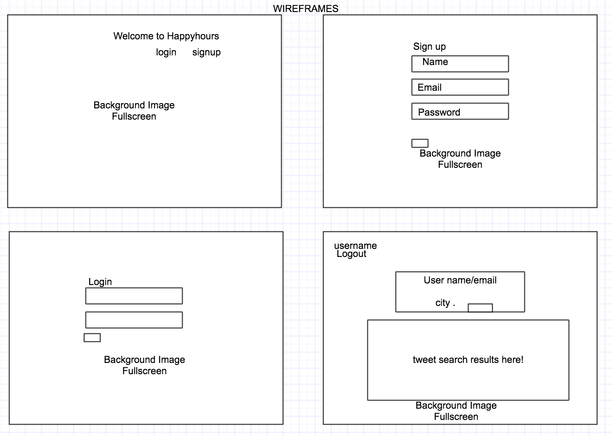
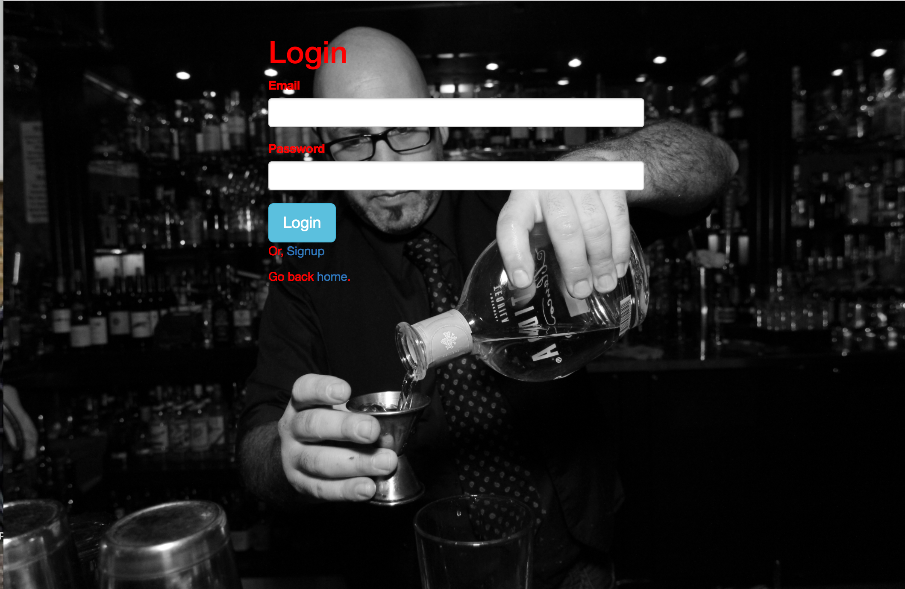
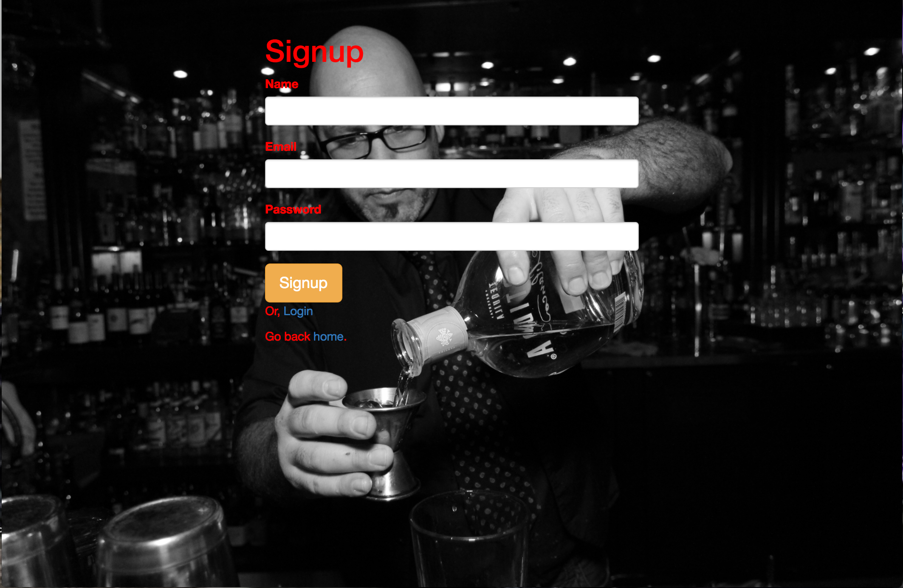
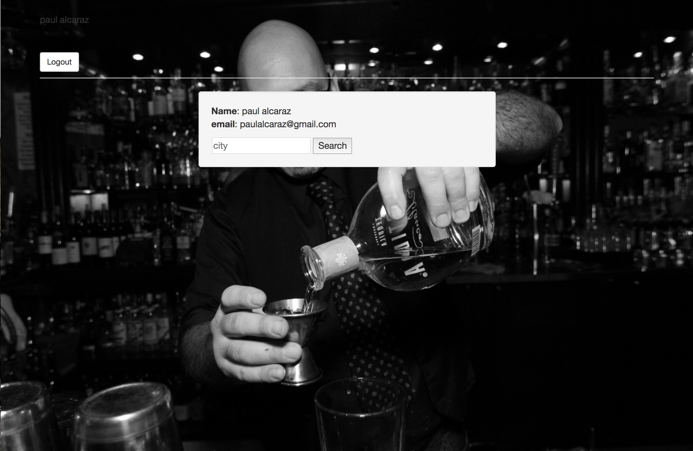

#The Happyhours App
##An quick app for finding happyhours.

##User Stories:
* User will have the ability to create account/login.
* Once logged in the user will enter a city and hit the submit button. The user will then get 10 tweets from twitter based off of the city location. 
* User may have the ability to save favorites (in a future version).
* User will have the ability to delete tweets.

##Technologies and stuff:
###The following packages where used:
* Express
* EJS
* Express-EJS-Layouts
* Express-Session
* Mongoose
* Flash
* Passport
* Cookie-Parser
* Body-Parser
* Twit
* Dotenv

###The following languages where used:
* HTML
* CSS
* Javascript

###The following Frameworks where used:
* Node.js
* Bootstrap
* JQuery

###The following Databases where used:
* MongoDB with Mongoose

###The following Third Party API was used:
* Twitter

##Wireframes

##Screenshots

